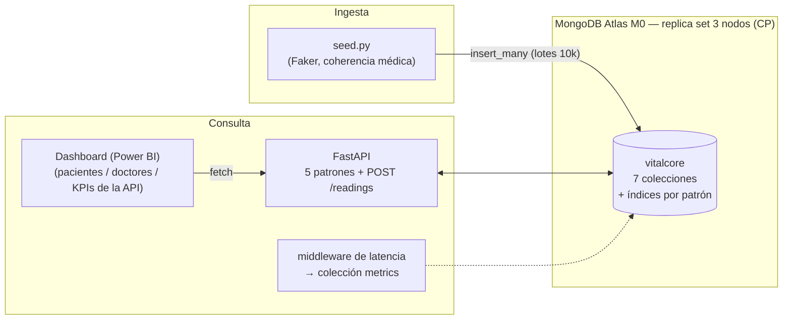

# Documento Técnico — VitalCore (Proyecto 02, NoSQL Implementation Challenge)

## 1. Selección del motor NoSQL

### 1.1 Patrones de acceso identificados (el diseño parte de aquí)

| # | Patrón de acceso | Frecuencia estimada | Forma dominante |
|---|---|---|---|
| P1 | Historial clínico completo de un paciente, cronológico | Media | Lectura por clave + orden temporal |
| P2 | Lecturas de un sensor de un paciente en rango de fechas | Alta | Serie de tiempo filtrada |
| P3 | Pacientes activos de un médico con última lectura vital | Alta | Lectura por clave secundaria + orden por riesgo |
| P4 | Alerta cuando un vital supera umbral definido por el médico | Alta (escritura) | Evaluación en ingesta + consulta por estado |
| P5 | Red de referidos del paciente (general → especialistas) | Baja | Recorrido de grafo acotado (2–3 saltos) |

### 1.2 Alternativas evaluadas

**MongoDB (documental) — elegido.**
- P1, P3 y P4 son consultas centradas en una entidad (paciente/médico) con
  estructura heterogénea: el modelo de documentos las resuelve con un solo
  `find` indexado.
- P2 se resuelve con **time series collections** (nativas desde MongoDB 5.0):
  almacenamiento en buckets columnares, compresión y consultas por rango de
  tiempo optimizadas — neutraliza la ventaja histórica de los motores columnares
  para telemetría a este volumen.
- P5 se resuelve con `$graphLookup` sobre la colección `referrals`: el grafo de
  referidos es pequeño y acotado (2–3 niveles), no justifica un motor de grafos
  dedicado.
- El enunciado privilegia **profundidad sobre amplitud**: un motor bien
  explotado por encima de una integración superficial de varios.

**Apache Cassandra / ScyllaDB (columnar) — descartado.**
- Excelente para P2 (particiones por `(patient_id, sensor)` con clustering por
  tiempo) y escrituras masivas, pero:
  - P1 y P3 exigirían duplicar datos en múltiples tablas por consulta
    (una tabla por query), con mantenimiento manual de esa duplicación.
  - Sin soporte razonable para P5 (grafos) ni para documentos heterogéneos
    con campos opcionales (perfiles clínicos, notas variables).
  - Su modelo AP (disponibilidad sobre consistencia, consistencia ajustable)
    es menos alineado con datos clínicos, donde leer un valor obsoleto tiene
    costo médico.
- A la escala del proyecto (200k lecturas) su ventaja de throughput no se
  materializa; su costo de modelado sí.

**Neo4j y Redis — descartados como motor principal** (analizados por
completitud): Neo4j solo domina en P5 (1 de 5 patrones); Redis es una capa de
caché/estructuras en memoria, no una base operativa primaria para historiales
clínicos persistentes.

### 1.3 Teorema CAP aplicado

Un sistema distribuido no puede garantizar simultáneamente Consistencia,
Disponibilidad y Tolerancia a Particiones; ante una partición de red debe
elegirse C o A.

**MongoDB en replica set es CP**: ante una partición, el lado sin mayoría deja
de aceptar escrituras en lugar de aceptar escrituras que luego divergirían.
Con `writeConcern: "majority"` una escritura solo se confirma cuando la mayoría
de los nodos la replicó; con `readConcern: "majority"` no se leen datos que
puedan revertirse.

**Por qué CP es el compromiso correcto en salud digital:** el costo de mostrar
un dato clínico obsoleto o no confirmado (una dosis, una lectura crítica, un
umbral de alerta) supera el costo de rechazar temporalmente una operación.
Preferimos que la plataforma responda «reintenta» a que un médico decida sobre
información inconsistente. Atlas M0 despliega un replica set de 3 nodos con
estas garantías por defecto (`w: majority` en el connection string).

**Relación con los conceptos de bases de datos distribuidas del curso:** el
replica set materializa la **replicación** con sus ventajas clásicas (mayor
disponibilidad y tolerancia a fallas: si cae un nodo, se elige otro primario
y el servicio continúa), mientras que el escalado horizontal de MongoDB
(*sharding*) es una **fragmentación horizontal** administrada por el motor:
la *shard key* cumple el rol del criterio de fragmentación y el enrutador
(`mongos`) aporta la **transparencia** — el cliente consulta sin saber en qué
nodo reside cada fragmento. A la escala actual del proyecto el sharding no es
necesario, pero el modelo de datos ya es compatible: `meta.patientId` sería
la shard key natural de la telemetría.

## 2. Diseño del esquema

### 2.1 Colecciones

| Colección | Tipo | Contenido |
|---|---|---|
| `patients` | documental | Perfil heterogéneo + umbrales del médico + **última lectura y nivel de riesgo embebidos** |
| `doctors` | documental | Perfil profesional y especialidad |
| `vital_readings` | **time series** (`timeField: timestamp`, `metaField: {patientId, sensorType}`) | 200k lecturas de telemetría |
| `consultations` | documental | Consultas con notas clínicas de longitud variable |
| `alerts` | documental | Alertas generadas al superar umbrales, con ciclo de vida (active/acknowledged/resolved) |
| `referrals` | documental (aristas de grafo) | Cadenas de referido `fromDoctorId → toDoctorId` por paciente, recorridas con `$graphLookup` |
| `metrics` | documental | Latencia de cada request de la API (KPI) |

### 2.2 Embebido vs. referenciado

**Embebido** (se lee junto, tamaño acotado):
- `emergencyContact`, `allergies`, `devices`, `thresholds` dentro de `patients`.
- `lastReading` + `riskLevel` dentro de `patients` — patrón *extended
  reference*: el patrón P3 («pacientes activos de un médico con su última
  lectura») se responde con **un único `find` indexado** en vez de una
  agregación sobre 200.000 lecturas. El snapshot se actualiza en la ingesta.
- Fundamento transaccional: en MongoDB el **documento es la unidad de
  atomicidad**. Embeber lo que se actualiza y se lee junto preserva la
  consistencia sin coordinar escrituras entre nodos ni pagar protocolos de
  confirmación distribuida (el *two-phase commit* que encarece las
  transacciones en bases de datos distribuidas relacionales).

**Referenciado** (crece sin límite o se comparte):
- `vital_readings`, `consultations`, `alerts`, `referrals` referencian
  `patientId`/`doctorId`. Embeber lecturas en el paciente rompería el límite
  de 16 MB por documento y degradaría toda lectura del perfil.

### 2.3 Anti-patrón evitado

**Trasladar el modelo relacional a MongoDB**: una colección por «tabla»
normalizada y reconstruir cada consulta con `$lookup` encadenados
(el equivalente a JOINs). Ese diseño convierte P3 en una agregación de 3
colecciones sobre 200k documentos en cada refresco de la vista del médico.
Nuestra decisión —duplicar de forma controlada la última lectura en el
paciente— acepta redundancia a cambio de que la consulta más frecuente sea
O(pacientes del médico) con índice, que es exactamente el intercambio que el
modelado orientado a consultas propone.

### 2.4 Estrategia de indexación

| Índice | Colección | Patrón que sirve |
|---|---|---|
| `{meta.patientId, meta.sensorType, timestamp desc}` | vital_readings | P2 (sensor + rango de fechas) |
| `{doctorId, status, riskLevel desc}` | patients | P3 (find cubierto y pre-ordenado) |
| `{patientId, date desc}` | consultations | P1 |
| `{status, createdAt desc}` | alerts | P4 (mapa de alertas activas) |
| `{patientId, fromDoctorId}` | referrals | P5 (`$graphLookup`) |
| `{specialty}` | doctors | consultas por especialidad |

**Evidencia** (`explain("executionStats")` contra Atlas M0, datos completos —
ver `logs/verificacion.log`, generado por `scripts/verify.py`):

- **P3** (`patients.find({doctorId, status:"active"}).sort({riskLevel:-1})`):
  etapa `IXSCAN` sobre `ix_medico_estado_riesgo`, **docsExamined = 60 =
  nReturned = 60**, tiempo de ejecución en servidor **0 ms**. El índice cubre
  filtro y orden: no hay escaneo de colección ni ordenamiento en memoria.
- Latencias extremo a extremo medidas en frío (cliente → Atlas, incluye red):
  P1 118,7 ms · P2 60,4 ms · P3 120,5 ms · P4 63,8 ms · P5 60,0 ms — sobre
  las 200.000 lecturas cargadas.

## 3. Pipeline de ingesta

Script `scripts/seed.py` (Python + Faker, semilla fija → reproducible):

- **Coherencia médica:** rangos plausibles por sensor (glucosa 45–420 mg/dL,
  SpO2 82–100%, etc.); los pacientes crónicos generan más lecturas y sus
  anomalías corresponden a su condición (diabético → glucosa alta, EPOC → SpO2
  baja).
- **Calibración con referencias clínicas:** los rangos normales y umbrales de
  alerta se calibraron con criterios clínicos estándar en lugar de valores
  arbitrarios — glucemia según los criterios diagnósticos de la American
  Diabetes Association (normal <140 mg/dL posprandial, hipoglucemia <70,
  crisis hiperglucémica >250), presión arterial según las categorías
  AHA/ACC (normal <120 mmHg sistólica, crisis hipertensiva >180), SpO2 <90%
  como hipoxemia clínicamente significativa, y frecuencia cardíaca fuera de
  50–145 lpm como umbral de alerta configurable por el médico.
- **Coherencia temporal:** lecturas y consultas dentro de los 6 meses simulados
  (ene–jun 2026) y posteriores a la fecha de inscripción del paciente.
- **Alertas derivadas, no aleatorias:** solo cuando una lectura supera el
  umbral que su médico definió para ese paciente.
- **Rendimiento:** inserción por lotes de 10.000 (`insert_many`, `ordered=False`).

**Resultado de la carga (2026-07-09, verificado con `scripts/verify.py`):**
500 pacientes, 50 médicos, **200.000 lecturas exactas** (2026-01-01 →
2026-06-30), 1.000 consultas, 6.336 alertas derivadas de umbrales y 245
referidos encadenados.

## 4. Arquitectura del sistema

La generación de alertas ocurre **en la ingesta** (tanto en `seed.py` como en
`POST /readings`): cuando una lectura supera el umbral definido por el médico
del paciente, la alerta se inserta junto con la lectura y el snapshot embebido
del paciente se actualiza atómicamente. Esto puede demostrarse en vivo:
insertar una glucosa de 320 mg/dL vía `POST /readings` hace aparecer la
alerta de inmediato en `GET /alerts/active`.

## 5. KPIs y latencias medidas

Cada request pasa por un middleware que registra su duración en la colección
`metrics`; `GET /metrics` expone promedio, p95 y conteo por endpoint, y toda
respuesta incluye el header `X-Response-Time-ms`. La medición formal se
produce con `scripts/measure_api.py` (ejecutable vía `PROBAR_API.bat`), que
ejercita cada patrón 30 veces con parámetros aleatorios realistas y genera
`logs/tabla_latencias.md`.

**Resultados** (30 iteraciones por consulta con parámetros aleatorios,
medidos el 2026-07-09; reporte completo en `logs/tabla_latencias.md`):

| Patrón / Consulta | Promedio (ms) | p95 (ms) | Mín (ms) | Máx (ms) |
|---|---|---|---|---|
| P1 `GET /patients/{id}/history` | 253,2 | 263,7 | 241,0 | 270,8 |
| P2 `GET /patients/{id}/readings` (sensor + rango) | 131,2 | 139,5 | 124,0 | 146,5 |
| P3 `GET /doctors/{id}/patients` | 195,1 | 202,1 | 186,4 | 210,3 |
| P4 `GET /alerts/active` | 139,9 | 145,8 | 128,8 | 146,0 |
| P5 `GET /patients/{id}/referrals` (`$graphLookup`) | 139,5 | 187,5 | 123,0 | 216,0 |

Del lado del servidor (colección `metrics`, sin el overhead HTTP del cliente
ni la persistencia de la propia métrica), los promedios bajan a: P1 179 ms,
P2 62 ms, P3 122 ms, P4 66 ms, P5 68 ms. La lectura clave: **P2 filtra
200.000 lecturas por paciente, sensor y rango de fechas en ~62 ms** gracias
al índice compuesto sobre la colección time series, y P1 es el más costoso
porque agrega dos consultas secuenciales (consultas médicas + alertas) — un
candidato natural a paralelizarse si el patrón se volviera crítico. La
latencia total está dominada por el viaje de red hasta Atlas (región
US East); en un despliegue co-localizado con la aplicación estos tiempos
se reducirían proporcionalmente.

**Alerta por umbral de extremo a extremo:** una lectura crítica insertada vía
`POST /readings` (glucosa 320 mg/dL) generó su alerta y quedó visible en
`GET /alerts/active` en 274 ms, incluyendo la actualización atómica del
snapshot del paciente.

## 6. Distribución de responsabilidades

| Integrante | Responsabilidad |
|---|---|
| Luis Perdomo | Base de datos y backend: modelado NoSQL, indexación, pipeline de ingesta (`seed.py`) y API REST en FastAPI |
| Melanie Gamboa | Interfaz de visualización: dashboard en Power BI y vistas de riesgo, alertas y KPIs |
| Manuel Martínez | Infraestructura: configuración del clúster en MongoDB Atlas y automatización de pruebas |
| David Crespo | Documento técnico: redacción, análisis del teorema CAP y marco teórico |
| Daniela Estrada | Calidad de datos y auditoría de IA: calibración semántica de datos de salud y bitácora de prompts |
| Mariangel Goncalves | Aseguramiento de calidad: validación de planes de ejecución (`explain`) y pruebas de la API |
